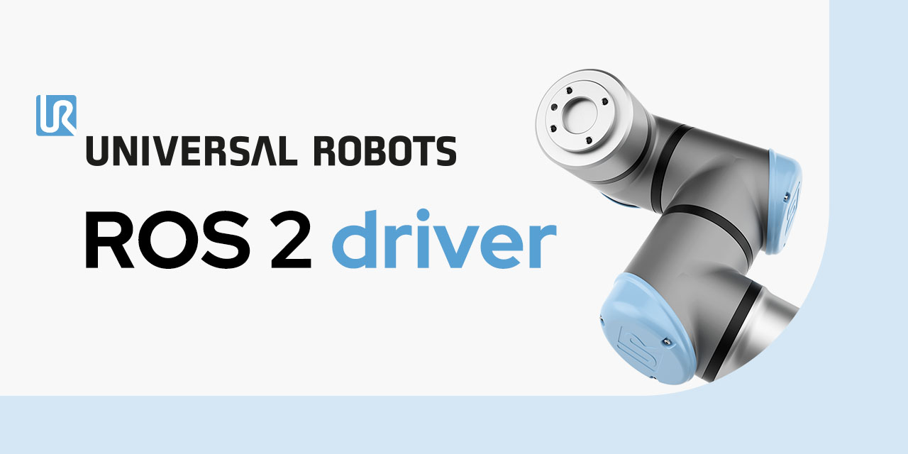

.. _documentation_home:

Welcome to the Universal Robots ROS 2 driver documentation!
===========================================================

   

This documentation covers everything around the ROS 2 driver packages for Universal Robots
manipulators and the standalone Universal Robots Client Library.

With those packages it is possible to control a Universal Robots arm from an external application
either directly using a C++ API (see :ref:`ur_client_library`) or using ROS 2 (see :ref:`ur_robot_driver`).

.. note::
   There is also builtin ROS 2 support for PolyScope X robots, see the `PolyScope X ROS 2 documentation <https://docs.universal-robots.com/polyscopex-ros2/v10.7/index.html>`_ and / or :ref:`ros2_controller_vs_driver` for details.

Table of Contents
-----------------

.. toctree::
   :titlesonly:

   ur_client_library <doc/ur_client_library/doc/index.rst>
   ur_description <doc/ur_description/doc/index.rst>
   ur_robot_driver <doc/ur_robot_driver/ur_robot_driver/doc/index.rst>
   ur_calibration <doc/ur_robot_driver/ur_calibration/doc/index.rst>
   ur_controllers <doc/ur_robot_driver/ur_controllers/doc/index.rst>
   ur_moveit_config <doc/ur_robot_driver/ur_moveit_config/doc/index.rst>
   ur_simulation_gz <doc/ur_simulation_gz/ur_simulation_gz/doc/index.rst>
   Tutorial examples <doc/ur_tutorials/tutorial_index.rst>
   doc/migration_notes.rst
   doc/build_status
   doc/ros2_controller_vs_driver
